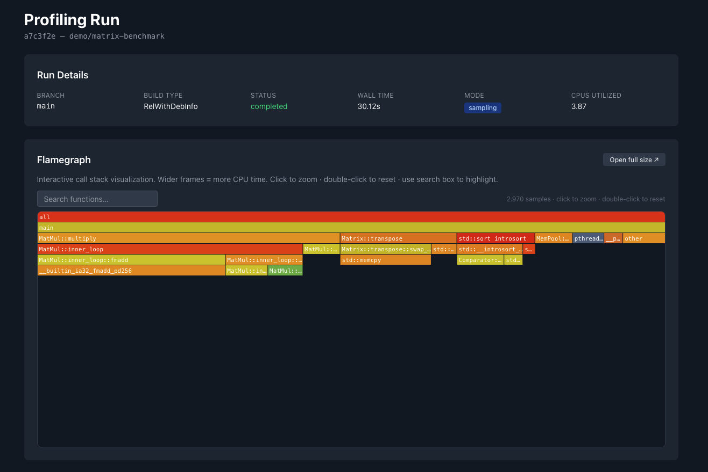

# RealBench

Performance Profiling as a Service for C++, Rust, and Go projects.

**[Live Demo](https://realbench-web.fly.dev/demo)** · **[App](https://realbench-web.fly.dev)** · free during beta




---

## Features

- 🔥 Sampling profiler via `perf_event_open` — zero instrumentation required
- 📊 Flamegraph generation (SVG) and interactive visualization
- 📈 Historical diff view for performance regression detection
- 🤖 LLM-based optimization suggestions powered by Anthropic Claude
- 🔐 Clerk authentication with per-user project isolation

## Project Structure

```
realbench/
├── action/           # GitHub Actions workflow template (copy into your repo)
├── apps/
│   ├── api/          # Hono API server + pg-boss profiling worker
│   └── web/          # React 18 dashboard (Vite, TailwindCSS, TanStack Query)
├── packages/
│   └── shared/       # Shared TypeScript types and Drizzle schema
└── lib/
    └── profiler/     # C++ sampling profiler (perf_event_open + N-API bindings)
        ├── src/      # sampler, flamegraph, diff, symbol_resolver
        ├── bindings/ # Node.js N-API addon
        └── tests/    # Google Test suite + sample sources (compiled binaries gitignored)
```

## Tech Stack

- **Backend**: Node.js 20, Hono, Drizzle ORM, pg-boss (PostgreSQL-native queue)
- **Frontend**: React 18, TypeScript, Vite, TailwindCSS, TanStack Query
- **Database**: PostgreSQL 15 (app data + job queue)
- **Storage**: Cloudflare R2 (flamegraph SVGs, uploaded binaries)
- **Auth**: Clerk
- **LLM**: Anthropic Claude
- **Profiler**: C++ (`perf_event_open`, libelf, N-API)
- **Deploy**: Fly.io (fra region)

## Used In

These repositories already use RealBench for continuous performance profiling in their CI pipelines:

| Repository | Language | Build | Profiling mode |
|---|---|---|---|
| [realbench-test-cpp](https://github.com/SaschaKohler/realbench-test-cpp) | C++ | CMake `RelWithDebInfo` | sampling + stat |
| [test-rust-project](https://github.com/SaschaKohler/test-rust-project) | Rust | `cargo build --release` + `RUSTFLAGS="-g"` | sampling + stat |
| [test-go-project](https://github.com/SaschaKohler/test-go-project) | Go 1.22 | `go build -gcflags="-N -l"` | sampling + stat |

Each repo builds its binary with debug symbols and uploads it to the RealBench API on every push and pull request. Results — flamegraphs, hotspot breakdowns, hardware counter reports, and LLM optimisation suggestions — are posted directly as PR comments.

Want to add profiling to your own repo? See [`action/README.md`](action/README.md) for a language-specific quick-start guide.

## Setup

### Prerequisites

- Node.js 20+
- pnpm 8+
- PostgreSQL 15+
- Linux host (required for `perf_event_open` in the profiling worker)

### Installation

```bash
# Install dependencies
pnpm install

# Setup environment variables
cp apps/api/.env.example apps/api/.env
cp apps/web/.env.example apps/web/.env
# Edit both .env files with your credentials

# Run database migrations
pnpm db:migrate

# Build shared package
pnpm --filter @realbench/shared build
```

### Development

```bash
# Start API and web in parallel
pnpm dev

# Or individually
pnpm --filter api dev    # http://localhost:3000
pnpm --filter web dev    # http://localhost:5173
```

### Building the C++ Profiler (Linux only)

```bash
cd lib/profiler
npm install
npm run build            # compiles the N-API addon via node-gyp

# Run integration tests
cd build && ctest

# Required system packages (Debian/Ubuntu)
sudo apt-get install libelf-dev libunwind-dev
sudo sysctl kernel.perf_event_paranoid=-1
```

### API Endpoints

| Method | Path | Description |
|--------|------|-------------|
| `GET` | `/health` | Health check |
| `POST` | `/api/v1/profile` | Upload binary and enqueue profiling job |
| `GET` | `/api/v1/profile/quota` | Get current user's monthly quota usage |
| `GET` | `/api/v1/projects` | List projects for authenticated user |
| `POST` | `/api/v1/projects` | Create new project |
| `GET` | `/api/v1/projects/:id/runs` | List profiling runs for a project |
| `GET` | `/api/v1/runs/:id` | Get run details (flamegraph URL, hotspots, suggestions) |
| `GET` | `/api/v1/runs/:id/diff/:baseId` | Compare two runs |
| `GET` | `/api/v1/api-keys` | List API keys for authenticated user |
| `POST` | `/api/v1/api-keys` | Create a new API key |
| `DELETE` | `/api/v1/api-keys/:id` | Revoke an API key |
| `POST` | `/api/v1/waitlist` | Join the waitlist |
| `GET` | `/api/v1/waitlist/status` | Check waitlist status |

## License

RealBench uses an **open-core** model:

| Component | License |
|-----------|---------|
| `lib/profiler/` — C++ sampling profiler core | [MIT](lib/profiler/LICENSE) |
| `apps/api/` — Hono API + worker | Proprietary |
| `apps/web/` — React dashboard | Proprietary |
| `packages/shared/` — shared TypeScript types | Proprietary |
| `action/` — GitHub Actions workflow template | MIT |

The C++ profiler core is free to use, fork, and embed in your own projects under the MIT license.
The hosted service (api, web, worker) is proprietary — you can read the source for reference, but not
run a competing service from it without permission.
